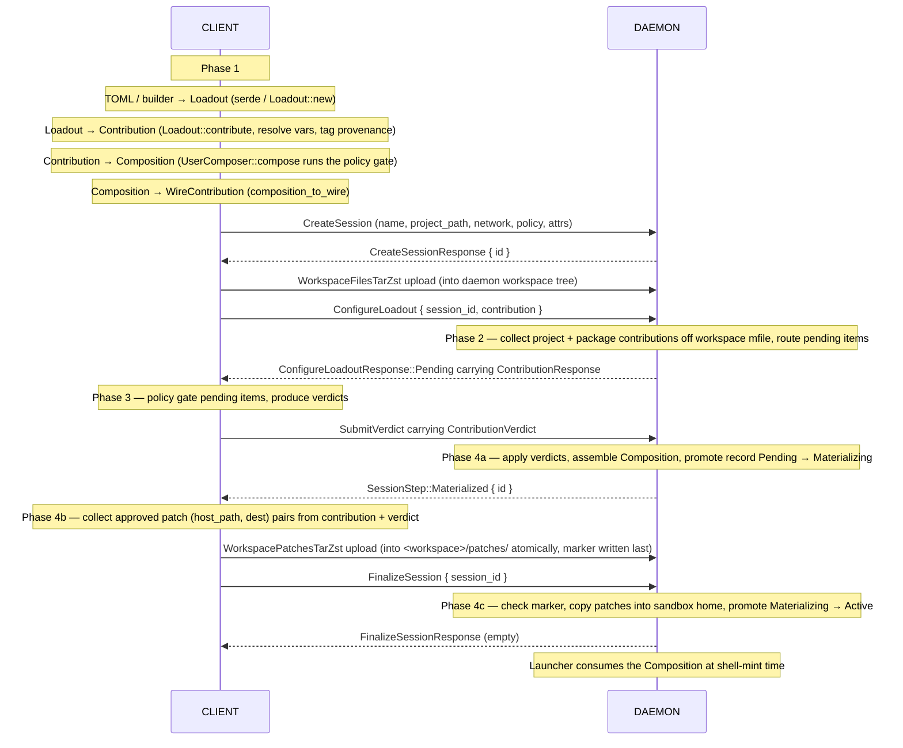
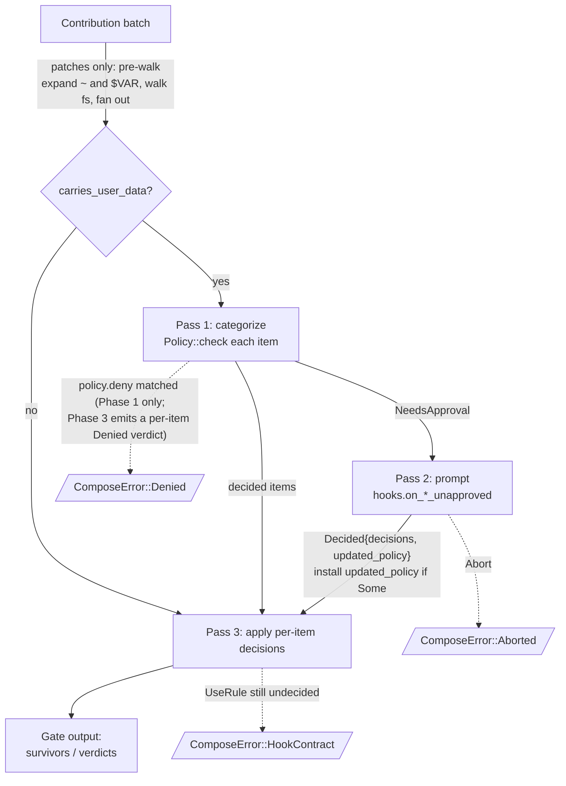

# Session Composition Data Flow

How contributions move from declarative sources to a `Composition`
the apply layer consumes. The pipeline is a **linear, four-phase
sequence** spanning two processes:

1. **Client composes** the user's loadouts.
2. **Daemon collects** project- and package-level contributions
   alongside the client's wire contribution, and emits anything
   that needs user gating.
3. **Client gates** those pending items against the user policy.
4. **Daemon assembles** the final `Composition`, the client streams
   the composition's approved patch files up to the daemon, and the
   daemon materializes them into the sandbox home before promoting
   the session to `Active`.

User policy is enforced **only on the client**. The daemon never
runs user policy; it forwards items needing approval and applies the
verdicts that come back.

## End-to-end flow

The daemon-side compose runs off the project files in the session's
*daemon-side workspace*, and the composition's approved patches
must land on the daemon's disk before the session is attachable —
so `min session activate` splits into four sequential RPCs bracketed by
two file-tree uploads:

Each phase consumes the previous phase's output and produces the
next phase's input. There is no loop: the daemon batches every
pending item into one `ContributionResponse`, and the client
batches every verdict into one `ContributionVerdict`.

**Why the split.** `CreateSession` only allocates the id; compose
runs later in `ConfigureLoadout`. The intervening
`WorkspaceFilesTarZst` upload is what stages the project's
`minimal.toml` — plus any local `packages/`, `stacks/`, `profiles/`
directories a project defines *for itself*, though most projects
have none of those. `ConfigureLoadout` reads the mfile off the
uploaded tree; the graph loader's `SourceProvider` (a
`checkouts::ManagerHandle`) then fetches every upstream layer
declared in `[upstream]` — that's where the package definitions
themselves usually come from, materialized into the daemon's
own checkouts dir (`~/.local/state/minimal/vcs/…`) rather than
carried in the tar. Merging create and configure into a single
RPC would leave the compose without a workspace mfile to start
from, so `find_mfile` would fall through to "no project
contribution" and every project-declared package (whether local
or upstream-supplied) would silently vanish.

The second upload + `FinalizeSession` exists because the finalized
`Composition` names patch source files that live on the *client's*
host filesystem (e.g. `~/.claude/**`, or a loadout's `~/.zshrc`).
The daemon can't reach those paths itself, so the client is
authoritative for streaming them up before the sandbox home can be
populated. Splitting the finalize step means an attach against a
session whose patches never arrived is refused (see
`SessionStatus::Materializing` below) rather than silently
succeeding into an empty home. The client's `cmd_activate`
unconditionally follows this order, even for `--sync none` (which
just skips the *first* upload — Phase 2 then composes against a
bare workspace and only whatever wire contribution came from
Phase 1 survives; the patches upload still runs against the
resulting composition).

**A re-`ConfigureLoadout` against a session with a pending stash is
refused with `WouldBlock`.** Overwriting the stashed
`PendingComposeState` would invalidate every `PendingId` the first
caller already received; the client has to `AbortSession` and start
a new session to retry.

## Phases in detail

### Phase 1 — Client composes loadouts

The user's loadouts are added to a `UserComposer` via
`UserComposer::add`. Each `Loadout::contribute(env)` call resolves
`VarValue::Inherit*` and tags items with `Source::UserLoadout`.
`UserComposer::compose(policy)` runs the **shared client-side gate
pipeline** (described below). User-origin items auto-pass the
`allow` step but still hit `deny` and `ignore`; vars whose value
was a literal or fell back to a default (`carries_user_data ==
false`) skip the policy check entirely — see the *carries_user_data*
invariant below. Every outcome is decidable, so the gate completes
without prompts. The output is a `WireContribution`, shipped to
the daemon inside `minimald_rpc::ConfigureLoadoutRequest {
session_id, contribution }`. The out-of-band session fields
(`name`, `project_path`, `network`, `policy`, `attrs`) ride
separately on `CreateSessionRequest.config`; internal callers that
don't compose (sftp, exec, session-recovery) supply
`WireContribution::default()` for the contribution half and the
daemon takes the empty-contribution fast path described in Phase 4.

### Phase 2 — Daemon collects and emits pending items

The daemon receives the `WireContribution` (already gated, trusted
verbatim), then reads the project mfile off the session's daemon-
side workspace (populated by the earlier `WorkspaceFilesTarZst`
upload) via `mctx::MFileSearchStrategy::Override`. From that mfile
it kicks off `graph_from_all_packages`, which walks the mfile
chain: for each `[upstream]` link the graph loader's
`SourceProvider` (a `checkouts::ManagerHandle`) resolves the layer
to a filesystem path — a git upstream is cloned into the daemon's
own checkouts dir (`~/.local/state/minimal/vcs/…`), a
`LinkConfig::Dir` upstream is read at its absolute path.
Package/stack/profile definitions typically come from those
upstream layers, not from the uploaded workspace; a project that
defines its *own* local `packages/`, `stacks/`, or `profiles/`
directory (rare in practice) rides in on the tar too.

From the resolved graph, `build_composables` derives:

- A `mfile::ProjectComposable` unioning the mfile's `[session]`
  block, its `[stack]` build/runtime packages, and the graph
  `Stack`'s `build_env_vars`. Contributed items are tagged
  `Source::Project { path }`.
- One `mfile::PackageComposable` per package in the transitive
  closure that declares `env_state_wiring` or `env_dir_mappings`/
  `env_file_mappings`. Items tagged `Source::Package { name }`.
  File mappings ship as `PackageFsMapping::File`; directory
  mappings as `PackageFsMapping::Dir`, and `contribute` shapes the
  walker source pattern as `<dir>/**` so the client walker fans out
  to descendants (a bare directory path with no glob would match
  no files and the mapping would silently vanish).

Missing packages are reported at `warn!` and skipped per-name (not
all-or-nothing) so an unresolvable `claude-code` doesn't wipe out
every *other* package's contribution. A graph-resolution failure
falls back to `ProjectResolution::MFileOnly` with a `warn!`, so
project vars still land but package contributions are empty.

`SessionComposer::compose` then drives the routing:

- **All-decided fast path.** If the daemon collected no vars and
  no patches, the composer assembles a `Composition` directly:
  daemon-collected packages and lifecycle hooks pass through
  (neither has a per-item verdict slot in the wire schema), and
  the client's already-gated wire contribution is merged in via
  `Composition::extend_from_wire`. Returns
  `ComposeOutcome::Ready(composition)`.
- **Pending path.** If the daemon collected any vars or patches,
  the composer routes every one of them back to the client as
  pending items — the daemon never runs user policy, so no
  daemon-origin item is ever auto-decided. The
  `ContributionResponse` carries the pending vars and patches
  plus a copy of the daemon-collected lifecycle hooks (for
  client-side audit; hooks have no per-item verdict slot).
  **Packages never appear on the wire** — the response schema has
  no slot for them; they stay in the daemon's `PendingComposeState`
  alongside the hooks so Phase 4 can finalize after the verdict
  comes back.

### Phase 3 — Client gates the pending items

The client receives the `ContributionResponse` and runs
`client::handler::handle_response` over the pending batch: resolves
any `Inherit`/`InheritWithDefault` vars against the client env
(`ResolvedVar::resolve_with`), expands patch sources against the
already-gated vars from Phase 1 plus anything approved in this
batch, applies the user policy, and prompts via local `PolicyHooks`
when the policy can't decide. Result: one `ContributionVerdict`,
shipped back to the daemon via `SubmitVerdict`. Lifecycle hooks in
the response are dropped — there's no per-hook policy, so the
verdict schema has no slot for them; the daemon installs them as
declared.

**Two hook implementations ship in `crates/minimal/src/prompt.rs`:**

- `InteractivePrompt` — an `inquire::Select`-driven prompter that
  offers `AllowOnce` / `AllowPermanent` / `IgnoreOnce` /
  `IgnorePermanent` / `DenyPermanent` / `Abort`. Permanent choices
  mutate a `RefCell`-held policy that `save_user_policy` writes to
  `user_policy.toml` after the composer finishes — atomically via
  `write-tmp + rename` with a `RemoveOnDrop` guard on the tmp file
  and a `.bak` copy of the previous contents.
- `NoPromptHook` — for `--no-prompt` and non-TTY runs. Fake-
  approves every unapproved item (returns `AllowOnce`) so
  `handle_response` runs *both* the var and the patch hook and
  accumulates every item that would have needed approval into an
  `UnapprovedSummary`. `cmd_activate` inspects `summary.count()`
  after `compute_verdict` returns and, if non-zero, sends
  `AbortSession` and bails with a ready-to-paste `user_policy.toml`
  snippet listing every item — the daemon never sees the fake
  approvals. If the summary is empty (every pending item was
  decided by the user's policy), the caller proceeds to
  `submit_verdict_and_wait` normally.

The TTY probe (`can_prompt_interactively`) requires both stdin
(where `inquire` reads keypresses) and stderr (where prompts
render) to be terminals; either being redirected takes the
`NoPromptHook` path.

**Verdict ordering.** Per-domain verdicts are not in pending-item
order: items the policy auto-decides are emitted in input order,
items routed through the hook land at the end. The daemon must
correlate by `id`, not slice position.

### Phase 4 — Daemon assembles, client uploads patches, daemon finalizes

Phase 4 has three sub-steps: the daemon assembles the finalized
`Composition` (**4a**), the client streams the composition's
approved patch files onto the daemon disk (**4b**), and the daemon
copies those files into the sandbox home and flips the record to
`Active` (**4c**). The record status walks
`Pending → Materializing → Active` — attach is refused until the
record reaches `Active`, so a client that dies mid-flow never
lands the operator on an empty-home shell.

#### Phase 4a — Assemble the Composition

**Materialized path.** On `ComposeOutcome::Ready`, the daemon
already holds a finalized `Composition` (built directly inside
`SessionComposer::compose`). The record is written as
`Materializing` (not `Active`) in one store write, the
`Composition` is retained on the live session actor
(`SessionInner::Active { composition, ... }`) for the launcher,
and `ConfigureLoadoutResponse::Materialized` ships.

**Pending path.** On `ComposeOutcome::Pending`, the daemon
stashes the matching `PendingComposeState` on the session actor
(`SessionInner::Draft { pending: Some(state) }`), overwrites the
placeholder `session_id` on the `ContributionResponse`, and ships
`ConfigureLoadoutResponse::Pending { response }`. The client then
runs Phase 3 and sends a `ContributionVerdict` over the
`SubmitVerdict` RPC. The daemon's `SubmitVerdict` handler:

1. Reads the matching stash entry. Missing → `SessionStep::Fault`
   carrying `WireError::WrongState` (compose state is memory-only;
   see the "resume stash" invariant below). The stash is
   **cloned**, not taken — a verdict that fails to resume has to
   leave the session still resumable so the client can correct
   the offending item and re-submit.
2. Runs `resume_from_verdict` on the clone: per-item verdicts
   walked, `Approved` items take the verdict's value + the
   stashed source provenance, `Ignored` items drop silently,
   `Denied` items surface as `ComposeError::Denied` (project- or
   package-declared items the user policy rejected — the session
   can't finalize in a state inconsistent with what was declared).
   Verdicts are deduplicated per `PendingId` up front so a client
   that ships two entries for the same id gets an actionable
   "duplicate" error instead of an "unknown" one from the second
   lookup. On any error here the handler returns
   `SessionStep::Fault` and the actor stays `Draft { pending:
   Some(_) }`.
3. Merges the stashed `client_contribution` via
   `Composition::extend_from_wire` — same cross-process conflict
   checks as the Materialized path.
4. Promotes the record `Pending → Materializing` via `store.save`
   (not `Active` — that comes in Phase 4c after the client has
   uploaded patches).
5. Replaces the actor's `SessionInner::Draft { pending: Some(_) }`
   with `SessionInner::Active { composition, ... }`. Note the
   asymmetry: the actor is `Active` (has a composition in memory)
   while the on-disk record is `Materializing` — the record's
   status tracks *external* attachability, the actor's `inner`
   tracks *whether compose has produced a Composition*.
6. Replies with `SessionStep::Materialized { id }`.

**Resume stash is in-memory only.** A `Draft` actor spawned from
an on-disk `Pending` record (daemon restart, or the session was
created before a crash) has `pending: None` — nothing to resume.
`SubmitVerdict` against such a session faults with a
`WrongState`, and the client has to `AbortSession` and create a
new session to retry. Survival across restarts is a separate
concern.

#### Phase 4b — Client uploads the composition's patches

The finalized `Composition` names patch source files by their
host paths. Only the client can reach those paths, so it's
authoritative for the upload. `cmd_activate` collects the
`(host_path, sandbox_destination)` pairs from two sources:

- `contribution.patches` — patches contributed by client-side
  loadouts, which never round-tripped through the daemon.
- `approved_patches_from_verdict(&verdict)` — patches the daemon
  surfaced as pending in Phase 3 and the user approved during
  Phase 3 gating.

Deduplicated by destination (the composer's cross-process check
guarantees duplicates are exact matches with identical sources),
the pairs stream up over the `WorkspacePatchesTarZst` subsystem.
The daemon unpacks each entry into `<workspace>/patches/<dest>`
via a staging-dir + atomic rename: entries land in
`<workspace>/patches.tmp/`, and only on a clean stream end does
the daemon `rename(patches.tmp → patches)` and then write the
zero-byte `.patches_ready` marker. A mid-stream failure leaves
`patches.tmp` behind for the next attempt to overwrite — the
real `patches/` tree is never partial.

Per-entry validation on the daemon side:

- **Traversal**: every entry's path is checked with
  `safe_relative_path` (rejects absolute paths and any `..`
  component) before any byte lands on disk. `SandboxRelPath`
  already rejects these on the wire, but the daemon re-checks
  because the client is not trusted.
- **Marker collision**: an entry whose path exactly equals
  `PATCHES_READY_MARKER` (`.patches_ready`) is rejected — writing
  it would first race the marker write, and then
  `materialize_patches_into_home` would silently copy the emptied
  marker into the sandbox home, zeroing whatever the user had
  there.
- **Size cap**: entries larger than `MAX_PATCH_ENTRY_BYTES` (1
  GiB) are rejected before allocation, so a peer forging a tar
  header can't drive `Vec::with_capacity` to `usize::MAX` (panic)
  or trigger the allocator's OOM handler (whole-daemon abort).

Body writes are dispatched onto a `JoinSet` capped at
`available_parallelism()` tasks so unrelated small files land in
parallel, and any error aborts every in-flight task before
propagating so no writes outlive the failing upload.

#### Phase 4c — FinalizeSession

The client calls `FinalizeSession` once the patches upload has
returned cleanly. The daemon:

1. Refuses if the actor is `Materializing` on-disk but the
   in-memory `SessionInner` has no `composition` — this catches
   a `Materializing` record whose actor was respawned from disk
   after a daemon restart (the composition lives in memory
   only). See the "restart-orphaned records are reaped or
   refused" invariant below.
2. If the `Composition` has patches, checks that
   `<workspace>/patches/.patches_ready` exists on disk. Missing
   → `InvalidInput` with an instruction to upload patches and
   retry. Composition-with-no-patches short-circuits this check
   (nothing to upload).
3. Runs `materialize_patches_into_home`: for each
   `SessionPatch`, copies
   `<workspace>/patches/<destination>` to
   `<home>/<destination>`, creating parents as needed. Done once
   at finalize (not on every attach) so subsequent attaches see
   the same tree without re-copying and any in-sandbox
   modifications persist.
4. Promotes the record `Materializing → Active` via `store.save`
   and registers the PTask hostname so the session is reachable.
5. Replies with `FinalizeSessionResponse` (empty).

Already-`Active` sessions are a no-op: `FinalizeSession` is
idempotent under a client retry after a lost ack.

**Apply.** Whichever path produced the `Composition`, the launcher
consumes it when the session's shell is minted: packages and vars
are fed into the sandbox `Env`; patches (already materialized into
the sandbox home during Phase 4c) contribute file mappings that
the launcher's rootfs setup picks up; lifecycle hooks are held on
`SessionInner::Active { composition, ... }` and logged at `info!`
with `deferred = true` — the in-sandbox exec plumbing for hooks
is still to land. Operator visibility is intact:
`log_session_contents` in `crates/minimald/src/session_host.rs`
enumerates every composition item with its provenance.

**Response shape.** `CreateSession` returns
`CreateSessionResponse { id }`. `ConfigureLoadout` returns either
`ConfigureLoadoutResponse::Materialized` (composition finalized in
one shot) or `ConfigureLoadoutResponse::Pending { response }`
(client must gate before the composition assembles). `SubmitVerdict`
returns `SessionStep::Materialized { id }` on success.
`WorkspacePatchesTarZst` is a channel subsystem, not a JSON RPC —
it carries a zstd-compressed tar stream and closes on completion;
errors return via the channel's stderr. `FinalizeSession` returns
`FinalizeSessionResponse` (empty). The `id` is allocated at
`CreateSession` time, so every follow-up RPC and upload targets
the same session.

**State guards.** A session in `SessionStatus::Pending` or
`SessionStatus::Materializing` is not attachable via a shell:
the attach path routes through `configure_loadout` if the
session is still `Draft`, and rejects `Materializing` records
with `AttachError::SessionPending`. Metadata-only RPCs
(`GetSessionRecord`, `ListSessions`, `RenameSession`,
`DestroySession`) keep working over both non-Active states so
operators can see and clean up sessions stuck mid-activation.

**Empty-contribution fast path.** When the client's wire
contribution is `default()` AND the daemon's workspace has no
mfile (or the mfile's project/package contributions are all
empty), Phase 2 emits no pending items,
`Composition::extend_from_wire` merges nothing, and the record
persists as `Materializing` in one shot with an empty
`Composition`. The composition has no patches, so Phase 4b is a
no-op and `FinalizeSession` short-circuits the marker check and
finalizes immediately. Internal callers today (sftp, exec,
session-recovery) skip the file upload, skip user contribution,
and drive this compressed path directly.

`Composition`'s fields: `vars: Vec<SessionVar>`, `patches:
Vec<SessionPatch>`, `packages: Vec<ProvenancedPackage>`,
`lifecycle_hooks: Vec<ProvenancedHook>`. Vars and patches are
policy-gated (so they're wrapped as `Session*`); packages and hooks
pass through unchanged.

## The shared client-side gate pipeline

The two phases share `Policy::check`, the hook prompt protocol, and
the `UseRule` re-check. They differ in what happens once an item is
`Decided`: Phase 1 (`gate_vars`/`gate_patches` in `core::compose`)
treats `Denied` as fatal and silently drops `Ignored`; Phase 3
(`gate_pending_vars`/`gate_pending_patches` in `client::handler`)
emits a per-item `WireVarVerdict`/`WirePatchVerdict` for every
outcome — the wire schema requires one verdict per pending id.
Patches add a filesystem walk up front; vars don't.

Both phases start each var by checking `ResolvedVar::carries_user_data`
and short-circuiting to `Allowed` when it's `false` — see the
*carries_user_data* invariant below.

Below, in numbered prose:

1. **carries_user_data short-circuit.** Every var is inspected
   before the policy check. If `carries_user_data == false` (a
   `Specified` literal or an `InheritWithDefault` that fell back
   to the default), the var moves data known at package/project/
   loadout authoring time — not the user's env — into the
   sandbox. The user policy exists to gate *user env* crossing
   into the sandbox; there's nothing to gate here. Auto-approve
   without consulting `allow`/`deny`/`ignore`.
2. **Patch pre-walk.** For each `Patch`, expand `~` and `$VAR` in the
   source pattern (using the already-gated vars from earlier in the
   batch plus the composer's `HOME` env lookup as tilde fallback).
   Walk the filesystem under each expanded root and fan out to one
   `PatchFile` per matching file. Expand `~` and `$VAR` in
   `PatchesPolicy` patterns the same way, against a temporary copy
   (the raw policy is preserved for round-trip).
3. **Pass 1 — Categorize.** Each item runs through `Policy::check`,
   which steps through:
   - `ignore` matches? → `Ignored`. Phase 1 drops silently;
     Phase 3 emits an `Ignored` verdict.
   - `deny` matches? → `Denied`, regardless of origin. Phase 1
     surfaces `ComposeError::Denied`; Phase 3 emits a `Denied`
     verdict.
   - `Source::UserLoadout`? → `Allowed` (auto-pass the allow step;
     the user doesn't need to allow-list their own loadout).
   - `allow` matches? → `Allowed`. Phase 1 pushes; Phase 3 emits
     an `Approved` verdict and adds the var to the in-batch
     expansion context.
   - Otherwise → `NeedsApproval`; defer to Pass 2.
4. **Pass 2 — Prompt.** Call `hooks.on_*_unapproved(policy_copy,
   &[Unapproved])`. The hook returns either `Abort` (→
   `ComposeError::Aborted`) or `Decided { decisions, updated_policy
   }`. If `updated_policy` is `Some`, install it for the re-checks
   in Pass 3. There is no per-item deny: denial terminates the whole
   composition, which is what `Abort` already does, so to reject a
   single item the hook returns `Abort`.
5. **Pass 3 — Apply.** Per-item decisions:
   - `AllowOnce` → push.
   - `IgnoreOnce` → drop (Phase 1) or emit `Ignored` verdict (Phase 3).
   - `UseRule` → re-run `Policy::check` against the (possibly
     updated) policy; act on the new outcome. If the policy *still*
     can't decide, surface `ComposeError::HookContract` — the
     application lied.

In Phase 1 (user loadouts only) every item is either short-circuited
by `carries_user_data == false`, auto-allowed by the
`Source::UserLoadout` step, ignored, or denied at Pass 1 — Pass 2 is
never invoked. In Phase 3 the items are project/package origin, so
the auto-allow doesn't apply and Pass 2 is the normal path for
anything not in `allow` or `deny` (and not short-circuited by
`carries_user_data`).

## Vocabulary

Three operations are deliberately distinguished so the names don't
overload:

- **Resolve** — turn a deferred reference into a concrete value.
  `ResolvedVar::resolve_with` does this for `VarValue::Inherit*`;
  patch source expansion does it for `$VAR` and `~` inside patterns.
- **Gate** — apply the `UserPolicy` (allow/deny/ignore + hooks).
  `gate_vars` and `gate_patches` are the per-domain gates.
- **Compose** — the top-level pipeline that accumulates
  contributions and drives the gates. Each composer's `compose`
  method.

`ResolvedVar`, `ResolvedPatch`, `ResolvedVar::resolve_with` use
"resolve" narrowly. `Composition`, `ComposeError`, `ComposeOptions`,
`compose_contribution` describe the pipeline.

## Key invariants

- **User policy lives on the client.** The daemon never runs user
  policy. Phase 3 happens on the client: it gates the items the
  daemon couldn't auto-decide and emits verdicts. Phase 4 on the
  daemon applies those verdicts without re-checking them.
- **`carries_user_data` gates policy enforcement.** The
  `ResolvedVar::carries_user_data` bit is `true` whenever the
  value came out of a successful env lookup — either
  `VarValue::Inherit` or `VarValue::InheritWithDefault` when the
  env had an entry. It stays `false` for `Specified` literals and
  for `InheritWithDefault` when the env was empty and the value
  fell back to the declared default. The bit is preserved through
  the wire (`WireResolvedVar.carries_user_data`, `#[serde(default)]`
  for older peers) and through the daemon's `From<WireResolvedVar>`
  conversion. Both client-side gate entrypoints (`gate_vars` in
  `core::compose` and `classify_var` in `client::handler`) short-
  circuit false to `Allowed` regardless of policy — the intent is
  that the user policy exists to control what pieces of the
  user's environment cross into the sandbox, not to referee what
  packages hardcode. A package that ships `LD_PRELOAD = "/tmp/x"`
  as a literal is a package-declaration matter, not a policy
  matter.
- **Composers accumulate; compose decides.** Per phase, all
  contribution happens first; the gate pipeline runs over the
  accumulated `Contribution`. Phases 2 and 3 are linked by exactly
  one message each direction — `ContributionResponse` out,
  `ContributionVerdict` in — never more.
- **`Composable::contribute` is the only entry point.** Contributors
  produce a `Contribution`; composers absorb it via
  `Contribution::merge`. There is no public way to push raw
  primitives — every item must carry a known `Source`.
- **Env lookup lives on the composer.** Both composers default to
  `std::env::var` for the `contribute()` step and accept
  `with_env(...)` to pin a custom closure for tests. The
  difference is in patch-source `~` expansion: `UserComposer`
  passes its `env("HOME")` as the tilde fallback, but
  `SessionComposer` passes `None` — daemon-side `~/...` patterns
  must resolve against a `HOME` carried in the client's wire
  vars, never against the daemon's process env. Phase 3's
  `handle_response` reads `HOME` from the client env it was given.
- **Source travels end-to-end.** Every primitive carries its `Source`
  through every gate and into the final `Composition`, so downstream
  layers (audit, inspection commands, error reporting) can attribute
  every surviving item to its contributor.
- **Vars and patches are policy-gated; packages and hooks are not.**
  Package selection happens downstream in the graph layer; lifecycle
  hooks execute inside the sandbox. Neither needs an
  `allow`/`deny`/`ignore` gate.
- **User-origin items auto-pass `allow`; `deny` and `ignore` still
  apply.** The user doesn't need to allow-list their own loadout
  entries — Pass 1 treats `Source::UserLoadout` as a free pass on
  the allow step — but a deny rule still rejects them and an
  ignore rule still drops them. As a consequence, the client's
  initial composition never needs to prompt (every outcome is
  decidable: ignored, denied, auto-allowed, or `carries_user_data`-
  short-circuited).
- **Package fs mappings distinguish file vs directory.**
  `mfile::PackageFsMapping::File` produces a source pattern equal
  to the path; `PackageFsMapping::Dir` produces `<dir>/**` so the
  client walker enumerates descendants. The distinction is a
  typed enum, not a stringly-typed `"ends in /**"` convention —
  callers can't accidentally hand `PackageComposable::new` a bare
  directory path that the walker would then treat as a single
  file, silently dropping the whole mapping.
- **Patches fan out before policy check.** A single `Patch` with a
  glob source becomes N `PatchFile`s; each is checked independently.
  In Phase 1 a `Denied` on any one file aborts the composition;
  in Phase 3 each file gets its own `WirePatchVerdict` so a Denied
  doesn't abort, it just rejects that file.
- **Hook gets narrow policy by value.** The gate hands the hook an
  owned `VarsPolicy` or `PatchesPolicy` — never `&mut UserPolicy`. To
  add a rule, the hook returns the modified copy in
  `HookResult::Decided.updated_policy`; the gate installs it before
  Pass 3.
- **Wire items submitted from the client are trusted on the daemon
  side.** The Phase 1 `WireContribution` and the Phase 3
  `ContributionVerdict` both carry decisions the user has already
  made. The daemon doesn't re-gate them. The client-supplied
  `WirePatchVerdict::Approved.destination` is trusted for
  content but validated at deserialization: `SandboxRelPath::try_new`
  rejects both absolute paths and any `..` component, so a
  malicious client can't submit `"../../etc/foo"` to escape the
  sandbox home.
- **Source `~` is expanded at gate time; dest has no `~` to expand.**
  Patch source `FileSet` patterns and `PatchesPolicy` patterns expand
  `~` against a resolved `HOME` — a session var named `HOME` first,
  else the client-side fallback (`UserComposer`'s `env("HOME")` in
  Phase 1, `handle_response`'s `env("HOME")` in Phase 3). The
  `SessionComposer` (Phase 2/4 daemon side) has no fallback —
  daemon `~/...` patterns must resolve from the client's wire vars.
  `PatchDest` is always relative to the sandbox user's home;
  absolute paths and `..` components are rejected at construction.
  A leading `~/` prefix on the destination is **silently stripped**:
  destinations are already home-relative, so a package author who
  writes `path = "~/.claude"` in their mfile means "place `.claude`
  under sandbox home", not "place a literal `~` directory there." A
  bare `~` re-hits the empty-dest check. Patterns retain their `~`
  form in returned policies, so save/load is lossless.
- **Conflict detection is post-gate.** Per-domain rules:
  - **Vars**: same name + same resolved value → both kept (no
    conflict); same name + different values → `Conflict::VarValueMismatch`.
  - **Patches**: same destination + same source → both kept;
    same destination + different sources → `Conflict::PatchSourceMismatch`.
  - **Packages**: deduplicated by name (set semantics, no value
    to disagree on).
  - **Lifecycle hooks**: concatenated unconditionally (hooks are
    code that runs; two identical scripts run twice).

  Checks run *after* the policy gate has filtered each side —
  inside `compose_contribution` on the survivors of
  `gate_vars`/`gate_patches`, and inside
  `Composition::extend_from_wire` on the chained union of the
  already-gated daemon side and the already-gated wire payload.
  `Contribution::merge` is pure aggregation; running checks there
  would fire before `ignore` could take effect.

  Conflicts are fatal today. The user mitigates by adding the
  conflicting var name to their policy's `ignore` list (or, for
  patches, a pattern matching the conflicting source paths) —
  matched items are dropped during the gate, so the post-gate
  check has nothing to compare. Interactive resolution (replace
  fatal-on-conflict with a hook the user can answer) is not
  implemented; the `Result`-returning merge shape is the place it
  would land.
- **Client is authoritative for the patches upload.** Patch source
  files live on the client's host filesystem, so after a successful
  Phase 4a the client streams the composition's approved patches
  up via `WorkspacePatchesTarZst` and calls `FinalizeSession`. The
  daemon can't reach those paths itself, so there's no daemon-side
  fallback if the client bails — the session sits at
  `Materializing` and is not attachable until `FinalizeSession`
  clears the marker check. The client's `cmd_activate` runs the
  upload + finalize as a single transaction; on error it
  `best_effort_destroy`s the session so operators don't accumulate
  stuck `Materializing` records.
- **`Materializing` records don't survive daemon restart.** The
  `SessionInner::Active { composition, .. }` state that Phase 4a
  produces is persisted to a `composition.json` sidecar alongside
  `record.json` so a restart can restore it for `Active` sessions.
  But a `Materializing` record means the patches upload hasn't
  completed — the sidecar exists but the patches marker doesn't,
  so `Manager::init` runs `reap_unresumable_records` at startup and
  deletes any `Pending` or `Materializing` record it finds (with an
  `info!` log). If a race lets one through, `finalize` refuses with
  an `InvalidInput` fault ("session is Materializing but has no
  in-memory composition") so the operator sees the problem
  instead of silently attaching to an empty-home shell.
- **Patches unpack is atomic; the marker is the precondition.**
  Entries land in `<workspace>/patches.tmp/` first; only on a
  clean stream end does the daemon install the new tree at
  `<workspace>/patches/` and write the `.patches_ready` marker.
  `FinalizeSession` checks the marker before promoting the
  record. A mid-stream failure leaves `patches.tmp` behind for
  the next attempt to overwrite; the real `patches/` tree is
  never partial and the marker never lies.

  The install uses `renameat2(RENAME_EXCHANGE)` when a prior
  `patches/` tree exists — the kernel swaps the two directories
  atomically, so a `FinalizeSession` racing the swap sees either
  "old contents + old marker" or "new contents + new marker,"
  never a gap where `patches/` is absent or where the marker
  points at content that isn't there. First install (no prior
  tree) falls through to a plain `rename`, which is atomic when
  the destination doesn't exist. The old contents (which end up
  under the staging path after the exchange) are cleaned up
  best-effort afterward.

  Two concurrent uploads for the *same* session don't corrupt
  each other. Each upload writes to a per-upload unique staging
  directory (`patches.upload.<nanos>.tmp`), so the unpack phases
  never share disk state. The install-and-marker step then takes
  a per-session mutex (`SessionHandle::patches_upload_lock`), so
  only one upload at a time is running the `RENAME_EXCHANGE +
  marker write` critical section — the second upload's swap
  observes the first's finished tree as its "old contents" and
  overwrites cleanly. The lock is held only across the
  seconds-of-work install step, never across the
  minutes-of-work unpack, so throughput is unaffected.

  The marker filename is reserved: an incoming patch entry whose
  path exactly equals `PATCHES_READY_MARKER` is rejected by the
  unpacker, since otherwise `materialize_patches_into_home` would
  silently copy the emptied marker into the sandbox home.
- **Peer-supplied entry sizes are capped, and a per-run byte
  budget bounds total in-flight memory.** Two limits stack:
  - `MAX_PATCH_ENTRY_BYTES` (1 GiB) refuses any single tar entry
    whose declared size would push `Vec::with_capacity` into an
    allocation panic or OOM (allocator abort → whole-daemon down).
  - `MAX_UNPACK_INFLIGHT_BYTES` (1 GiB) is a `Semaphore` acquired
    *before* each body is read from the tar stream. If the total
    bytes held across in-flight write tasks would exceed the
    budget, the tar loop parks — pumping backpressure through the
    pipe into the SSH channel — instead of piling additional
    bodies into RAM.
  Peak daemon memory during unpack is therefore bounded by the
  budget, *not* multiplied by CPU count. Legitimate patch
  payloads are small dotfile trees; both ceilings exist as
  adversarial-input backstops, not throughput knobs.
- **Internal invariants panic, not error.** `compute_dest` panics on
  precondition violation. These are bug signals, not recoverable.
- **Terminating failure modes:** `Denied` (explicit policy reject),
  `Aborted` (hook returned `Abort`), `Conflict` (two contributors
  disagree on a var value or patch source — see the post-gate
  detection invariant above; surfaces as `ComposeError::Conflict`
  from both `compose_contribution` and the cross-process daemon
  merge in `Composition::extend_from_wire`), `HookContract`
  (application bug — wrong decision count, or `UseRule` to a
  still-undecidable item), `HookRequired` (non-user-origin item
  reached a legacy `core::compose` path with no hook to prompt —
  Phase 2 now routes such items through `SessionComposer::compose`
  instead; this remains for the per-side `compose_contribution`
  codepath), `PatchWalk` (IO-level filesystem walk failures),
  `Expansion` (malformed `$VAR` / `~` pattern, or undefined var),
  `VarResolution` (a Phase 3 pending `Inherit` var couldn't be
  resolved against the client env), `InvalidPendingPatchDest` (a
  Phase 3 pending patch destination violates `PatchDest`
  invariants), `InvalidWireItem` (a wire-form item failed
  conversion back to its domain type, or the verdict is malformed:
  duplicate `PendingId` entries, missing entries for stashed items,
  unknown ids, or a pending patch whose walk root can't be
  represented as a `HostAbsPath` for the synthetic-Ignored
  fallback).
