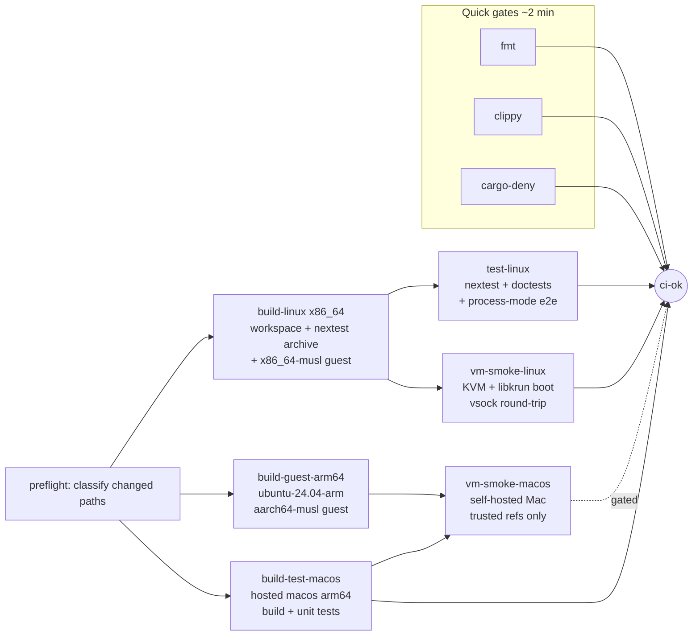

# CI Strategy: Rust client / host-daemon / guest-daemon system (libkrun + KVM)

> **How this maps to gominimal/minimal.** This is the design the CI refactor
> ([#687](https://github.com/gominimal/minimal/issues/687)) implements, adopted
> policy, not aspiration. A few terms map to this repo's shape:
>
> - The strategy's single-workflow + `preflight` is realised as **six
>   always-triggered lane workflows** (`ci`, `ci-linux-native`, `ci-linux-kvm`,
>   `ci-macos`, `ci-shell-installer`, `ci-kani`), each with an in-workflow
>   `changes` job (dorny/paths-filter) and an `if: always()` aggregator; the
>   first five aggregators are the required checks (`ci-kani-success` is
>   advisory until promoted).
> - The "compile once per triple, fan out" archive pattern lives in the KVM
>   and macOS lanes (`cargo nextest archive` + prebuilt binaries → a
>   toolchain-free test job; the mac mini compiles nothing, per §7); the same
>   unified proof (`scripts/session-e2e.sh`) runs on all three targets.
> - The strategy's `cargo xtask` is this repo's **justfile + `scripts/`**, the
>   same "logic in reviewed code, YAML stays a thin scheduler" property (§10).
> - Guest kernel/rootfs come prebuilt from the GCS channel via the
>   `materialize` composite; the initramfs cross-compiles minimald to musl.
> - VM/subsystem harnesses are selected by **binary-name suffix**
>   (`*_integration.rs` non-root, `*_root_integration.rs` root) via the
>   filtersets `binary(/_integration$/) and not binary(/_root_integration$/)`
>   and `binary(/_root_integration$/)`, not the strategy's `vm_e2e_` test-name
>   prefix. (The `and not` matters: `_root_integration` also ends in
>   `_integration`.) "e2e" is reserved
>   for the full-CLI proofs that live under `scripts/` (e.g. `session-e2e.sh`);
>   the Rust harnesses are *integration* tests, guarded by per-crate meta-tests.
> - The nightly TEST tier is `nightly-tests.yml` (distinct from `nightly.yml`,
>   which cuts the release channel).
>
> The test-extension contract (§10) is the load-bearing part for contributors,
> see [CONTRIBUTING.md](https://github.com/gominimal/minimal/blob/main/CONTRIBUTING.md).

---

Research document, optimal CI shape on GitHub Actions for a Rust workspace targeting
**x86_64 Linux** and **arm64 macOS**, with three components:

| Component | Runs on | Notes |
|---|---|---|
| `client` | host (Linux, macOS) | user-facing |
| host daemon | host (Linux, macOS) | spawns/supervises libkrun VMs, provides vsock proxy |
| guest daemon | **inside the VM (always Linux)** | talks to client via vsock proxy; on Linux without KVM can connect to the client directly as a plain process |

Goals: fast PR feedback, no redundant compilation, cached builds, cargo tests, e2e smoke
tests, and a defensible PR-vs-nightly split.

---

## 1. Executive summary

The pipeline is a **tiered fan-out**: cheap gates first, then **one compile per target
triple** whose outputs (nextest archives, static guest binaries) are shared as artifacts
with the VM test jobs, which then need no Rust toolchain (in this repo the archive-replay
pattern is only the KVM and macOS lanes; `core-tests` and the `ci`/native/release/nightly
lanes run `cargo nextest run` directly). E2E runs at two
levels: a **process-mode suite** (guest daemon as a plain process, no VM, runs anywhere)
and a **real-VM smoke suite** (libkrun boot + vsock round-trip) that runs on stock
`ubuntu-latest` runners because **all x86_64 Linux hosted runners expose `/dev/kvm`**.
macOS VM smoke requires a **self-hosted Apple Silicon machine** (hosted macOS runners
cannot nest virtualization); it is gated to trusted refs. Everything expensive,
matrix-expanding, or advisory-flavored moves to a nightly cron that doubles as a
cache-primer for main.

Target: **≤ ~10 min PR wall-clock** on the common path (quick gates ~2 min, build ~4-6 min
warm, tests and VM smoke overlapping in parallel).



---

## 2. Platform facts that constrain the design

These five facts, all verified against primary sources, dictate the shape:

1. **`/dev/kvm` is available on every x86_64 Linux hosted runner**, larger runners since
   Feb 2023, the standard 2-vCPU `ubuntu-latest` since Apr 2024
   ([changelog](https://github.blog/changelog/2024-04-02-github-actions-hardware-accelerated-android-virtualization-now-available/)).
   One permissions step is required (udev rule, §5). Live proof: **libkrun's own CI boots
   real microVMs with a guest agent over vsock on plain hosted runners, on every PR**
   ([integration_tests.yml](https://github.com/libkrun/libkrun/blob/main/.github/workflows/integration_tests.yml)).
   Caveat: GitHub has declined to document nested virt as supported
   ([runner-images#12933](https://github.com/actions/runner-images/issues/12933)),
   the Android-emulator ecosystem depends on it so regression risk is low, but nonzero.

2. **arm64 Linux hosted runners (`ubuntu-24.04-arm`) have no `/dev/kvm`**
   ([community discussion](https://github.com/orgs/community/discussions/148648)). Linux
   arm64 is out of scope for this project's targets, but these runners are still useful:
   they build the aarch64 guest binary natively (fact 5).

3. **Hosted macOS runners cannot create VMs.** They are themselves M1/M2 VMs under Apple's
   Virtualization framework; Hypervisor.framework calls fail with `HV_UNSUPPORTED`
   ([runner-images#9460](https://github.com/actions/runner-images/issues/9460)). Apple's
   nested-virt support (macOS 15+) requires M3/M4 hosts and only covers Linux guests;
   GitHub's request to enable it was **closed "not planned"**
   ([runner-images#13505](https://github.com/actions/runner-images/issues/13505)).
   → Exercising libkrun/HVF on macOS in CI requires **bare-metal Apple Silicon**
   (self-hosted). This holds for *every* VM-based macOS provider (Tart, Orka, Anka,
   GitLab, Cirrus hosted), bare metal is the only way.

4. **libkrun's vsock needs nothing from the CI host kernel.** libkrun implements
   virtio-vsock in userspace; the host side of every guest vsock port is a plain
   **AF_UNIX socket** (`krun_add_vsock_port`), and TSI networking rides the same device
   ([libkrun.h](https://github.com/libkrun/libkrun/blob/main/include/libkrun.h)).
   No `vhost-vsock` module, no `modprobe`, no host AF_VSOCK support. The only host
   requirements are `/dev/kvm` (Linux) or the HVF entitlement (macOS). This is the same
   "hybrid vsock" design as
   [Firecracker](https://github.com/firecracker-microvm/firecracker/blob/main/docs/vsock.md),
   and it is what makes VM smoke tests viable on hosted runners at all.

5. **The guest daemon is always a Linux binary**, even for macOS hosts (libkrun boots a
   Linux microVM there). Build it as a static musl binary per host arch:
   - `x86_64-unknown-linux-musl`, natively on `ubuntu-latest` with `musl-tools`.
   - `aarch64-unknown-linux-musl`, natively on `ubuntu-24.04-arm` (free for public
     repos since Aug 2025, private standard runners since Jan 2026;
     [GA changelog](https://github.blog/changelog/2025-08-07-arm64-hosted-runners-for-public-repositories-are-now-generally-available/)).
     No cross toolchain, no Docker/`cross`, no zigbuild needed in CI.
   musl-static guest agents are the ecosystem norm (kata-containers' `kata-agent`,
   libkrun's own test `guest-agent`).

---

## 3. Test taxonomy

Order tests by cost; push each test into the cheapest tier that can catch its failure.

| Tier | What | Where | Cost |
|---|---|---|---|
| 1 | `cargo fmt --check`, `cargo clippy --all-targets`, `cargo-deny` | any runner, no VM | seconds-2 min |
| 2 | unit + integration tests (`cargo nextest run`), `cargo test --doc` | Linux + macOS runners | minutes, warm-cached |
| 3 | **process-mode e2e**, guest daemon as a plain process, direct client connection | Linux runners, no KVM needed | minutes |
| 4 | **VM smoke e2e**, boot real libkrun VM, client → vsock proxy → guest daemon round-trip, handful of scenarios | `ubuntu-latest` (KVM) + self-hosted Mac | ~5-10 min |
| 5 | extended e2e, long scenarios, supervision/restart paths, stress, larger matrix | nightly | tens of minutes |

**Tier 3 is this project's structural advantage.** The Linux no-KVM fallback (guest daemon
connects directly to the client) means the full client↔guest protocol, lifecycle, and
supervision logic can be tested with zero virtualization, deterministic, fast, runnable
on any runner. This is exactly gVisor's platform strategy (`systrap` everywhere, `kvm`
where hardware allows: [platform guide](https://gvisor.dev/docs/architecture_guide/platforms/)).
Firecracker and cloud-hypervisor have no such mode and carry permanent bare-metal fleets
just to gate PRs; the process mode avoids that fate.

**Write the e2e suite once, parametrized over transport** (process-direct vs VM+vsock),
gVisor-style target duplication, rather than maintaining two suites. Tier 4 then only
needs to prove the VM/vsock/boot path itself, so a *handful* of smoke scenarios suffices
on PR; behavioral breadth lives in tier 3.

**Tagging:** keep VM tests out of default `cargo nextest run` runs (this repo gates them
with `#[ignore]` + an env var) and select them explicitly in the VM jobs with filtersets
here by binary-name suffix, `-E 'binary(/_integration$/)'`
([nextest filtersets](https://nexte.st/docs/filtersets/)). Reference nextest CI profile
(cloud-hypervisor uses `retries = 3` for flaky VM boots,
[.config/nextest.toml](https://github.com/cloud-hypervisor/cloud-hypervisor/blob/main/.config/nextest.toml)):

```toml
# .config/nextest.toml
[profile.ci]
retries = 2
fail-fast = false
slow-timeout = { period = "60s", terminate-after = 5 }   # hard kill hung VM boots

[profile.ci.junit]
path = "junit.xml"
```

Harness rules (firecracker/lima consensus): every VM test times out, expects a clean
environment, and leaves one behind (kill leaked VMs in teardown; nextest's `leak-timeout`
flags leaked child processes); always capture guest console/serial output and upload as
a workflow artifact with `if: always()`.

---

## 4. Build & cache strategy

### Cache: `Swatinem/rust-cache@v2`, not sccache

The consensus across corrode.dev, rustprojectprimer, and independent measurements: on
hosted runners, [rust-cache](https://github.com/Swatinem/rust-cache) wins. sccache's GHA
backend **never caches bin/dylib/proc-macro crates** (anything that links), is slower
than a warm target-dir hit, and regresses cold builds (Depot measured −16.8% cold,
−27.7% on release builds). Revisit sccache only if moving to runner providers with
co-located object storage (Depot, Namespace).

Configuration rules:

- **`shared-key` per (target-triple × job class)**, rust-cache does not key on
  `--target` automatically; jobs building different triples or feature sets must not
  share a key, and jobs building identically should (e.g. `build-linux` and
  `vm-smoke-linux` share, if the latter compiles anything at all).
- **<span v-pre>`save-if: ${{ github.ref == 'refs/heads/main' }}`</span>**, PRs restore but never write.
  GitHub cache is branch-scoped (PRs read own branch + default branch only) and
  LRU-evicts at 10 GB (raisable since Nov 2025, but stay under it). PR churn writing
  caches evicts the main caches every PR actually wants.
- `CARGO_INCREMENTAL=0` (rust-cache sets it automatically; incremental is pure overhead
  and bloat in CI).
- Dedicated CI profile to shrink `target/` and speed linking, without touching dev builds:

```toml
# Cargo.toml
[profile.ci]
inherits = "dev"
debug = "line-tables-only"   # or 0; usable backtraces vs smallest cache
incremental = false
```

### Compile once per target, fan out

The workspace compiles **exactly once per target triple**; everything downstream consumes
artifacts:

1. **`cargo nextest archive --archive-file tests.tar.zst`** in the build job →
   `actions/upload-artifact` → test jobs download and
   `cargo nextest run --archive-file ...` with **no toolchain-warm-cache rebuild at all**
   ([canonical example](https://github.com/nextest-rs/reuse-build-partition-example/blob/main/.github/workflows/ci.yml)).
   Test jobs need a same-revision checkout for fixtures, nothing else.
2. **Guest musl binaries** built once per arch → artifact → consumed by VM-smoke jobs
   and the host-daemon packaging step.
3. Doctests are the one thing nextest cannot run, keep a cheap `cargo test --doc` step
   in the build job (compiles against the already-built lib).

Avoid the classic redundancy traps:

- Don't run `cargo build` then `cargo test` as separate compilations, test artifacts
  differ (`#[cfg(test)]`, dev-deps). The archive pattern sidesteps this.
- **Identical flags everywhere**: `--locked` on every cargo invocation; uniform
  `RUSTFLAGS` (or prefer `CARGO_BUILD_WARNINGS: deny` over `RUSTFLAGS: -Dwarnings`,
  RUSTFLAGS participates in fingerprints and forks caches when it drifts between jobs).
- **Feature unification**: always drive CI with the same feature set (`--workspace`
  with a fixed feature list). `cargo build -p foo` resolves different unified features
  than `--workspace` → same deps rebuilt twice. If per-crate builds are ever needed,
  [cargo-hakari](https://crates.io/crates/cargo-hakari)'s workspace-hack is the escape hatch.
- Install CI tools (nextest, cargo-deny) via
  [taiki-e/install-action](https://github.com/taiki-e/install-action) (prebuilt
  binaries), never `cargo install` in CI.
- Toolchain: pin with `rust-toolchain.toml` + `dtolnay/rust-toolchain`.

### Embedding the guest binary

Cargo's proper mechanism (artifact dependencies / `bindeps`,
[RFC 3028](https://rust-lang.github.io/rfcs/3028-cargo-binary-dependencies.html)) is
**still nightly-only with open musl cross-compile bugs**, not usable on a stable
toolchain. The pattern every VMM project uses instead is *guest assets as external
artifacts with a local-build fallback*:

- build.rs on the host daemon reads an env var pointing at the guest binary
  (`GUEST_DAEMON_PATH`), `include_bytes!`s it (or packages it beside the binary);
  `cargo:rerun-if-env-changed` keeps it correct.
- In CI the env var points at the downloaded artifact; locally, an `xtask` builds the
  guest for the current arch first and sets the var. (Firecracker downloads guest
  artifacts from S3; crosvm from GCS; propolis via an artifact TOML with
  remote/local/CI-output sources, same shape.)

---

## 5. PR pipeline

All jobs carry `timeout-minutes` (default job timeout is 6 h) and the workflow carries:

```yaml
concurrency:
  group: ${{ github.workflow }}-${{ github.ref }}
  cancel-in-progress: ${{ github.ref != 'refs/heads/main' }}
```

**Jobs** (see diagram in §1):

| Job | Runner | Does | Est. (warm) |
|---|---|---|---|
| `fmt` | ubuntu-latest | `cargo fmt --check`, no cache, no deps | <1 min |
| `clippy` | ubuntu-latest | `cargo clippy --workspace --all-targets --locked` (own cache key; clippy shares artifacts with `check`, not `build`) | 2-4 min |
| `deny` | ubuntu-latest | `cargo-deny check`, **licenses/bans blocking; advisories `continue-on-error`** (Embark's own recommendation: a newly published advisory must not break unrelated PRs) | 1 min |
| `preflight` | ubuntu-latest | classify changed paths (cloud-hypervisor pattern); docs-only changes skip everything below | seconds |
| `build-linux` | ubuntu-latest | workspace build, `nextest archive`, `cargo test --doc`, x86_64-musl guest → upload artifacts | 4-6 min |
| `build-guest-arm64` | ubuntu-24.04-arm | aarch64-musl guest → artifact | 2-3 min |
| `test-linux` | ubuntu-latest | nextest from archive (tier 2) + **process-mode e2e** (tier 3) | 2-4 min |
| `vm-smoke-linux` | ubuntu-latest | KVM perms step → boot libkrun VM with real guest daemon → client→vsock→guest round-trip smoke; console logs uploaded `if: always()` | 3-6 min |
| `build-test-macos` | macos-15 (arm64) | build + unit tests, **no VM** | 4-6 min |
| `vm-smoke-macos` | self-hosted Mac | download client/host-daemon (from macOS build) + aarch64 guest artifacts → libkrun/HVF smoke. **Gated** (§7): same-repo PRs via label, always on main/merge-queue | 3-6 min |
| `ci-ok` | ubuntu-latest | join job, `needs:` everything, `if: always()` + fail-on-any-failure | seconds |

The KVM permissions step (used by GitHub's own changelog, android-emulator-runner, and
libkrun):

```yaml
- name: Enable KVM group perms
  run: |
    echo 'KERNEL=="kvm", GROUP="kvm", MODE="0666", OPTIONS+="static_node=kvm"' \
      | sudo tee /etc/udev/rules.d/99-kvm4all.rules
    sudo udevadm control --reload-rules
    sudo udevadm trigger --name-match=kvm
```

**Why `ci-ok` and `preflight` instead of workflow-level `paths:` filters:** a
`paths:`-filtered workflow that is also a required check leaves PRs stuck at *"Waiting
for status to be reported"*. An always-running join/aggregator as the required check,
this repo uses **one per lane** (the five `*-success` aggregators), each with an
in-workflow `changes` job deciding what to skip, avoids the deadlock entirely and makes
adding/removing jobs a workflow-only change, not a branch-protection change.

**Merge queue (optional but recommended once the team grows):** add `merge_group:` as a
trigger; run the *full* set (including `vm-smoke-macos` unconditionally) in the queue,
wasmtime-style, and consider trimming PR runs further (wasmtime PRs default to smoke-only
with `prtest:full` opt-in).

---

## 6. Nightly pipeline (cron on main)

Everything here is valuable but either too slow, too flaky-adjacent, or not tied to a
specific PR:

| Task | Rationale / precedent |
|---|---|
| **Extended e2e** (tier 5): long-running scenarios, VM supervision/restart/kill paths, stress, both platforms | rustls daily-tests rule: move out of PR CI what is "too long or relies on flaky externals" |
| **Toolchain canaries**: full test run on `beta` and `nightly` rustc, `continue-on-error: true` | catch upcoming rustc breakage without blocking merges (official Cargo CI guide) |
| **`cargo-deny` advisories** (blocking here, non-blocking on PR) | tokio/wasmtime run advisories daily; wasmtime keeps it non-blocking because the advisory DB fetch itself flakes |
| **Latest-deps canary**: `cargo update` then test, `continue-on-error` | Cargo CI guide pattern; catches semver-compatible breakage early |
| **MSRV**: `cargo hack check --rust-version --workspace --all-targets` | cheap enough for PR too, if an MSRV is declared; official Cargo guide method |
| **miri** on pure protocol/logic crates (vsock framing, supervision state machines) | expensive; high value on unsafe/protocol code |
| **Hygiene**: `cargo-machete` (unused deps), `actionlint` + `zizmor` (workflow lint/security) | low cost, low urgency |
| **Cache priming**: the nightly run itself writes fresh caches on main | wasmtime runs a daily cron explicitly to "prime caches for GitHub Actions and the merge queue" |

Nightly failures should notify (issue-on-failure or Slack), not just rot in the Actions tab.

**As implemented** (`nightly-tests.yml`), mapping each row to what actually runs:

- **Extended e2e** — the `session-e2e-soak` job (10× serial reps) plus a **concurrency
  stress** step (`scripts/stress-session-e2e.sh`, N sessions minted in parallel);
  supervision/restart/kill lands as the auto-discovered
  `crates/minvmd/tests/supervision_integration.rs` harness (restart cycle + dirty-kill
  repair) and the restart cycle added to `scripts/minvmd-lifecycle.sh` — both of which run
  on **Linux/KVM and macOS/HVF**, the latter via the `macos-e2e` job that reuses
  `ci-macos.yml` through `workflow_call`.
- **Toolchain canaries** — `beta-canary` and `nightly-rustc-canary` jobs, both
  `continue-on-error`.
- **`cargo-deny` advisories** — the `advisories` job (blocking → feeds `notify`).
- **Latest-deps canary** — the `update-canary` job (`continue-on-error`).
- **MSRV** — the `msrv` job runs `cargo hack check --rust-version` directly (mirroring the
  `just msrv` recipe; blocking → feeds `notify`); the floor is declared once as
  `[workspace.package] rust-version` and inherited by every crate.
- **miri** — the `miri` job over the pure logic/protocol crates (`just miri`).
  **Non-blocking** (`continue-on-error`): miri is nightly-sensitive and slow, so it is read
  in the run rather than gated. The concurrency-stress step is likewise non-fatal until it
  has settled.
- **Hygiene** — the `hygiene` job (`continue-on-error`); `zizmor`'s pin policy and the
  documented finding ignores live in `.github/zizmor.yml`, `actionlint`'s runner-label
  allowlist in `.github/actionlint.yaml`.
- **Cache priming** — `session-e2e-soak` and the `msrv`/`miri` jobs restore+save their own
  cache classes (`save-if` main-only) so a scheduled main run keeps them warm.

Not in the table but present: the `installer` job re-runs the shell-installer suite nightly
(reused from `ci-shell-installer.yml` via `workflow_call`), catching runner-image shell
drift the path-scoped PR lane would miss. Blocking jobs (`advisories`, `session-e2e-soak`,
`installer`, `msrv`, `macos-e2e`) feed `notify`; the canaries and `miri` deliberately do not.

---

## 7. Self-hosted Mac runner

- **Hardware**: bare-metal Apple Silicon, a Mac mini in a closet, Scaleway/MacStadium
  bare metal, or Cirrus persistent workers. EC2 Mac works but has a 24-hour minimum host
  allocation (poor fit for CI economics). Any macOS *VM* product cannot nest HVF (§2.3).
- **Security, the critical one**: a self-hosted runner on a public repo must **never run
  fork PRs** (arbitrary code execution on your hardware, runner token theft). Gate
  `vm-smoke-macos` to trusted events: `push` to main, `merge_group`,
  `workflow_dispatch`, and same-repo PRs (`github.event.pull_request.head.repo.full_name
  == github.repository`) optionally behind a label + GitHub environment with required
  approval. Podman's `mac-pool` job group is the working precedent.
- **Serialize** VM jobs on the machine with a concurrency group sized to the hardware
  (`group: mac-vm-tests`), since libkrun VMs contend for HVF/memory.
- **Cleanup as a contract**: persistent runners accumulate state; run a cleanup script in
  a `post`/`if: always()` step killing leaked VMs and scrubbing temp dirs (podman ships
  `gha_mac_cleanup.sh` pre *and* post).
- **darwin gotcha**: Unix socket paths (the host side of libkrun vsock ports) hit macOS's
  104-byte `sun_path` limit, podman rejects `TMPDIR` ≥ 22 chars on darwin for exactly
  this reason. Keep the harness's socket dir short (`/tmp/x`), never under the default
  runner workspace path.
- Build nothing on this machine: hosted `macos-15` builds the darwin binaries, the arm
  Linux runner builds the guest; the Mac only downloads artifacts and runs the smoke
  suite (podman pattern). Keeps the trusted machine's job simple and short.

---

## 8. Local/CI parity

The failure mode to avoid is CI YAML drifting from what developers run. This project's CI
steps involve real logic, building the guest for the right arch, wiring the
`GUEST_DAEMON_PATH` env var, orchestrating VM smoke runs, collecting console logs, which
is reviewed code, not a command list. This repo keeps that logic in the **justfile +
`scripts/`** (the role the strategy assigns to `cargo xtask`):

- `just up` / `just up-kvm`, build the stack and bring it up for the host (macOS and `up-kvm` boot the guest VM)
- `scripts/session-e2e.sh`, the unified CLI session proof every target lane runs
- `scripts/build-initramfs.sh`, the musl guest (minimald) initramfs build

CI YAML stays a thin scheduler over the same recipes and scripts, the same "logic in
reviewed code" property as the [cargo-xtask pattern](https://github.com/matklad/cargo-xtask)
that bevy (`cargo run -p ci`) and propolis (`cargo xtask phd`) use; here the justfile +
`scripts/` fill that role.

---

## 9. What runs where

| Task | PR | main / merge queue | Nightly |
|---|:---:|:---:|:---:|
| fmt, clippy, cargo-deny (licenses/bans) | ✅ | ✅ | ✅ |
| cargo-deny advisories | ⚠️ non-blocking | ⚠️ | ✅ blocking |
| Workspace build + unit/integration tests (Linux x86_64, macOS arm64) | ✅ | ✅ | ✅ |
| Doctests | ✅ | ✅ | ✅ |
| Process-mode e2e (Linux) | ✅ | ✅ | ✅ |
| VM smoke e2e, Linux/KVM (hosted) | ✅ | ✅ | ✅ |
| VM smoke e2e, macOS/HVF (self-hosted) | label / same-repo only | ✅ | ✅ |
| Extended e2e, supervision/restart (blocking) + concurrency stress (non-blocking) | - | - | ✅ |
| beta/nightly rustc canaries | - | - | ✅ non-blocking |
| MSRV (`cargo hack check --rust-version`) | optional | - | ✅ blocking |
| `cargo update` latest-deps canary | - | - | ✅ non-blocking |
| miri (protocol crates) | - | - | ✅ non-blocking |
| Hygiene: cargo-machete, actionlint/zizmor | - | - | ✅ non-blocking |
| Shell-installer suite (runner-image drift) | path-scoped | - | ✅ blocking |
| Cache write (`save-if`) | ❌ restore-only | ✅ | ✅ (primes caches) |

---

## 10. Extending CI without editing workflows - the agent & developer contract

Contributors (human or agent) are required to ship tests and proofs with their work, but
must never modify `.github/workflows/`. The industry answer is **not** appendable stub
scripts; it is two mechanisms working together: freeze the workflow layer mechanically,
and make every test **discovered by convention, never registered**.

### 10.1 Freeze the workflow layer mechanically

Instructions alone ("do not touch GitHub Actions") are policy; enforce them structurally:

- **CODEOWNERS**: the repo-wide `* @gominimal/minimalists` rule (so the minimalists team
  owns `.github/` along with everything else) plus branch protection "require code owner
  review", any PR touching workflows is un-mergeable without human sign-off, no matter
  who or what authored it. This is the standard control; GitHub already treats workflow
  edits as privileged (fork PRs modifying workflows do not run with secrets).
- **Preflight guard**: the existing `preflight` job fails fast if a PR from an
  agent-labeled branch modifies `.github/**`, cheap belt-and-suspenders, and it gives
  agents an immediate, legible error instead of a review-time rejection.
- When humans *do* edit workflows: `actionlint` + `zizmor` (already in nightly) and
  SHA-pinned actions.

The reason the YAML can stay frozen at all is §8: workflows are thin schedulers over the
justfile recipes and `scripts/`. All logic that evolves, harness code, scenario wiring,
artifact handling, lives in that reviewed code, like any other
code. Agents *may* modify the harness; they may not modify the scheduler.

### 10.2 Every test is auto-discovered

The contract: **adding a test never requires a CI change.** Choose the tier by where the
test lives and what it's named; the matching CI job picks it up automatically.

As realised in this repo (the strategy's `vm_e2e_` prefix + `xtask` + `trycmd`
map to a binary-name suffix + `just`/`scripts`, per the preamble):

| Test kind | Where it goes | How CI discovers it | Local proof command |
|---|---|---|---|
| Unit | `#[cfg(test)]` module next to the code | cargo/nextest target discovery | `just test` |
| In-process integration | `crates/<crate>/tests/*.rs` | cargo target discovery | `just test` |
| Integration harness (real VM / kernel / netns) | `crates/<crate>/tests/*_integration.rs` (add `_root` → `*_root_integration.rs` if it needs `CAP_NET_ADMIN`) | the KVM/macOS/native lanes' non-root filterset `-E 'binary(/_integration$/) and not binary(/_root_integration$/)'` (root step: `-E 'binary(/_root_integration$/)'`, run under `sudo`) | `just test-vm` (root: `just test-root-integration`) |
| End-to-end (drives the `minimal` CLI through the whole system) | a script under `scripts/` (e.g. `session-e2e.sh`) | the target lane invokes the script | `just e2e` (Linux native daemon: `just e2e-native`) |

The discriminator between the last two rows is whether the test drives the
`minimal` CLI through a full user workflow: if so it is *end-to-end* and lives as
a script; otherwise, even booting a VM, it is an *integration* harness named
`*_integration.rs`.

Naming conventions are load-bearing here, so guard them two ways: every VM job
runs nextest with `--no-tests=fail`, so a filterset that matches nothing (typo'd
suffix, renamed file) fails loudly instead of green-washing the PR; and a
meta-test in each harness crate (`minvmd`, `minimald`), a normal unit test in
`core-tests`, asserts every file in *that crate's* `tests/` directory carries
the `_integration` / `_root_integration` suffix (with an allowlist for
deliberately-mothballed files), so a misnamed harness can never silently fall
out of CI. Ordinary `crates/<crate>/tests/*.rs` integration tests in other
crates are unaffected; they run in the workspace suite, not the VM lanes.

### 10.3 Why one-file-per-scenario beats append-to-script stubs

The tempting design, `scripts/e2e.sh` with a `# agents: append tests below` marker, is
an anti-pattern:

- **Merge conflicts by construction**: parallel agents all append to the same tail of the
  same file. One scenario per file means N agents produce N independent, conflict-free
  diffs; reverting one test is deleting one file.
- **Ordering coupling**: appended script blocks inherit shell state from everything above
  them; failures become position-dependent and unreproducible in isolation.
- **No compiler in the loop**: shell appended by an agent gets reviewed by nobody but the
  reviewer; a Rust test or a trycmd case file is checked by the toolchain and runs under
  the harness's timeouts, retries, and log capture for free.

This is the pattern every discovery-based test system uses (cargo's target discovery,
pytest collection, LLVM `lit`, rustc's `run-make`, a directory of self-contained cases,
globbed by the runner). The stable extension points to advertise to agents are therefore:
(a) cargo test locations, automatic; (b) the `*_integration.rs` VM-harness convention,
picked up by binary-suffix filterset; (c) the CLI proofs under `scripts/` (e.g.
`session-e2e.sh`) and the justfile recipes that wrap them, code-reviewed, for when a
genuinely new *kind* of check is needed. That last one is the escape hatch that keeps the
first two honest: new capabilities go through reviewed code, never through YAML.

### 10.4 Proofs

"Getting proofs" becomes cheap when local and CI runs are identical (§8):

- The local commands produce the same artifacts CI does: `cargo nextest run` writes the
  JUnit XML, and `just up` / `scripts/session-e2e.sh` produce the VM console logs and
  session transcripts. An agent's proof-of-work is that output attached to the PR; the
  reviewer re-derives it by reading the CI run, not by trusting the claim.
- CI publishes the JUnit summary to `$GITHUB_STEP_SUMMARY` (libkrun's `--github-summary`
  flag is precedent), so per-PR test evidence is visible without downloading artifacts.
- Optional soft gate: `preflight` warns (labels, does not fail) when a PR touches `src/`
  without touching any test path, a nudge, with the real enforcement left to review.

Document this contract in `CONTRIBUTING.md` / the agents' instruction file as a short
table (test kind → location → local command), and point CI failure messages at it.

---

## Appendix A - prior art (what named projects actually do)

- **libkrun**: full VM integration tests **on every PR** on hosted `ubuntu-26.04`
  (udev KVM step, musl-static `guest-agent` inside the VM, host/guest test halves over
  vsock, `--keep-all` log artifacts on `always()`); aarch64 on self-hosted; **no macOS VM
  job at all** (krunkit does build+unit only on `macos-latest`).
  [integration_tests.yml](https://github.com/libkrun/libkrun/blob/main/.github/workflows/integration_tests.yml)
- **podman (libkrun provider)**: the best macOS answer: binaries built on hosted
  `macos-26`, artifacts downloaded by a self-hosted `mac-pool` runner group, matrix over
  `provider: [applehv, libkrun]`, pre/post cleanup scripts, path-filtered.
  [ci.yml](https://github.com/podman-container-tools/podman/blob/main/.github/workflows/ci.yml)
- **cloud-hypervisor**: nextest-driven integration tests (retries=3, hard per-test
  kill) in containers with `/dev/kvm` passed in, on self-hosted bare metal; `preflight`
  change-classification job; everything PR/merge-queue gated.
  [ci.yaml](https://github.com/cloud-hypervisor/cloud-hypervisor/blob/main/.github/workflows/ci.yaml),
  [nextest.toml](https://github.com/cloud-hypervisor/cloud-hypervisor/blob/main/.config/nextest.toml)
- **firecracker**: pytest harness on AWS bare metal (Buildkite): layered VM fixtures,
  always-collect-cheap-artifacts, `nonci` markers exclude heavy tests from PR, perf/
  sanitizers scheduled. [tests/README](https://github.com/firecracker-microvm/firecracker/blob/main/tests/README.md)
- **wasmtime**: PRs run smoke-only by default with `prtest:full` opt-in; **full CI in
  the merge queue**; daily cron exists to prime caches; cargo-audit daily, non-blocking.
  [main.yml](https://github.com/bytecodealliance/wasmtime/blob/main/.github/workflows/main.yml)
- **tokio**: cheap `basics` job gates all expensive jobs via `needs:`; loom
  model-checking label-gated on PRs, full on master; cargo-deny daily + on lockfile-touching PRs.
  [ci.yml](https://github.com/tokio-rs/tokio/blob/master/.github/workflows/ci.yml)
- **rustls**: MSRV + cargo-deny blocking on PR; daily cron for internet-touching,
  post-quantum, and feature-powerset tests.
  [build.yml](https://github.com/rustls/rustls/blob/main/.github/workflows/build.yml),
  [daily-tests.yml](https://github.com/rustls/rustls/blob/main/.github/workflows/daily-tests.yml)
- **gVisor**: same behavioral suite duplicated across `systrap` (no virt) and `kvm`
  platforms, the precedent for this project's process-mode/VM-mode transport split.
  [platforms](https://gvisor.dev/docs/architecture_guide/platforms/)

## Appendix B - key sources

**Runner capabilities**
- KVM on all Linux x64 runners: https://github.blog/changelog/2024-04-02-github-actions-hardware-accelerated-android-virtualization-now-available/
- No KVM on arm64 runners: https://github.com/orgs/community/discussions/148648
- macOS nested virt unsupported / closed not-planned: https://github.com/actions/runner-images/issues/9460 , https://github.com/actions/runner-images/issues/13505
- Nested virt "experimental" stance: https://github.com/actions/runner-images/issues/12933
- arm64 Linux runners GA: https://github.blog/changelog/2025-08-07-arm64-hosted-runners-for-public-repositories-are-now-generally-available/

**libkrun / vsock**
- https://github.com/libkrun/libkrun (README, include/libkrun.h)
- https://github.com/libkrun/libkrun/blob/main/.github/workflows/integration_tests.yml
- https://github.com/firecracker-microvm/firecracker/blob/main/docs/vsock.md

**Caching / build speed**
- https://github.com/Swatinem/rust-cache
- https://corrode.dev/blog/tips-for-faster-ci-builds/
- https://blog.arriven.wtf/posts/rust-ci-cache/ (rust-cache vs sccache measurements)
- https://depot.dev/blog/sccache-in-github-actions (sccache cold-cache regressions)
- https://doc.rust-lang.org/cargo/guide/continuous-integration.html
- https://doc.rust-lang.org/cargo/guide/build-performance.html
- https://nickb.dev/blog/cargo-workspace-and-the-feature-unification-pitfall/
- Cache >10 GB purchasable: https://github.blog/changelog/2025-11-20-github-actions-cache-size-can-now-exceed-10-gb-per-repository/

**nextest**
- Archives (build once, run anywhere): https://nexte.st/docs/ci-features/archiving/
- Filtersets / default-filter: https://nexte.st/docs/filtersets/ , https://nexte.st/docs/selecting/
- Example workflow: https://github.com/nextest-rs/reuse-build-partition-example/blob/main/.github/workflows/ci.yml

**Guest binary building / embedding**
- Embedding a binary in a binary: https://zameermanji.com/blog/2021/6/17/embedding-a-rust-binary-in-another-rust-binary/
- bindeps still nightly, musl bugs: https://github.com/rust-lang/cargo/issues/9096 , https://github.com/rust-lang/cargo/issues/15095
- kata-agent musl/rootfs: https://github.com/kata-containers/kata-containers/blob/main/tools/osbuilder/rootfs-builder/README.md

**Conventions**
- cargo-deny advisories non-blocking: https://github.com/EmbarkStudios/cargo-deny-action
- xtask pattern: https://github.com/matklad/cargo-xtask
- Task-runner comparison: https://rustprojectprimer.com/tools/tasks.html
- Required-check paths-filter deadlock: https://github.com/orgs/community/discussions/44490
